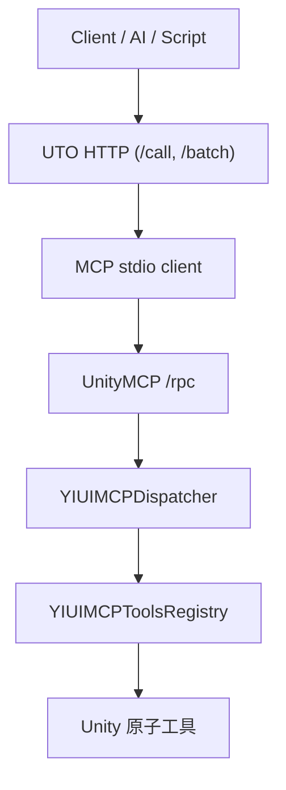

# UnityMCP + UTO 详细设计

本文档基于当前仓库的代码实现整理。

## 1. 系统结构



说明：

- 如果不走 UTO，也可以直接调用 Unity `/rpc`
- UTO 存在的主要价值是心跳检测和批量编排

## 2. 接口定义

### UnityMCP

- `GET /health`
- `POST /rpc`

`/health` 返回：

```json
{
  "status": "ok",
  "pid": 12345,
  "serverId": "guid"
}
```

`/rpc` 请求：

```json
{
  "jsonrpc": "2.0",
  "method": "TriggerCompile",
  "params": {
    "Force": false
  },
  "id": 1
}
```

### UTO HTTP

- `GET /health`
- `POST /call`
- `POST /batch`
- `GET /tools`

## 3. Unity 端设计

### `YIUIMCPServer`

- 使用 `HttpListener`
- 监听 `127.0.0.1:{port}`
- 处理 `/health` 与 `/rpc`

### `YIUIMCPServerHelper`

- `[InitializeOnLoad]` 自动初始化
- 监听编译、PlayMode、AssemblyReload、Unity 退出
- 进行健康检查和自动重启

### `YIUIMCPDispatcher`

- 负责把后台请求调度回 Unity 主线程

### `YIUIMCPToolsRegistry`

- 扫描当前 AppDomain 中非 `System` / `Unity` / `Microsoft` 前缀程序集
- 自动注册 `[YIUIMCPTools]` 与 `[YIUIMCPFlow]`

### `YIUIMCPExecutor`

- 统一处理：
  - `delayBeforeMs`
  - `timeoutMs`
  - `delayAfterMs`

## 4. UTO 端设计

### `index.ts`

- 作为 MCP stdio 入口
- `tools/call` 直接转发到 Unity `/rpc`

### `mcp-client.ts`

- 启动 `node index.js`
- 通过 stdin/stdout 与 MCP stdio 子进程通信

### `http-server.ts`

- 暴露更容易给脚本和 AI 调用的 HTTP 接口
- 把 HTTP 请求转换为 MCP `tools/call`

### `heartbeat-manager.ts`

- 每 500ms 心跳检查一次 Unity
- 利用 `serverId` 检测 Domain Reload
- 检测到实例变化后先等待稳定，再恢复就绪状态

## 5. 当前工具表

| 工具名 | 说明 |
|------|------|
| `Log` | 打印普通日志 |
| `LogError` | 打印错误日志 |
| `EnterPlayMode` | 进入运行模式 |
| `StopPlayMode` | 退出运行模式 |
| `TriggerCompile` | 触发编译 |
| `GetCompileResult` | 获取编译结果摘要 |
| `GetConsoleLog` | 获取控制台日志 |
| `ExecuteMenu` | 执行 Unity 菜单命令 |
| `AssertConsoleContains` | 断言控制台日志包含关键词 |

## 6. 当前流程能力

- Flow 声明：`compile-unity-flow`
- 实际推荐流程入口：`Config/compile-unity-flow.ps1` 或 UTO `/batch`

## 7. 设计边界

- Unity 侧只做原子工具执行
- UTO 侧做连接管理和编排
- 外部脚本层做固定工作流封装
